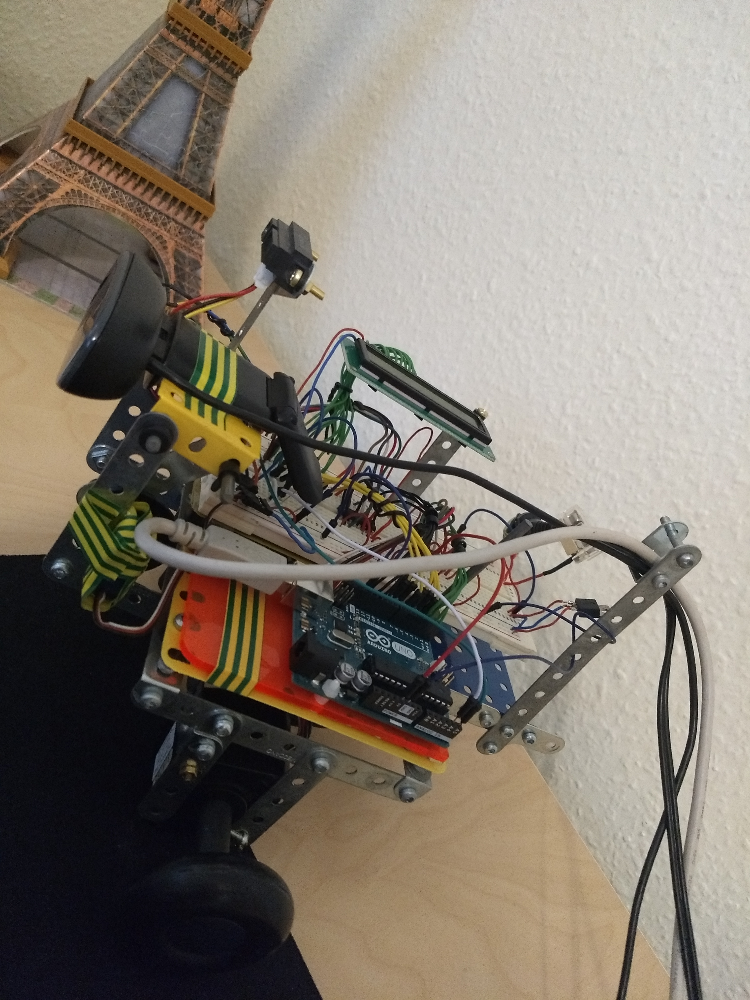

# Breadbot - Arduino & Unity Code

This repository contains code for a cobbled together robot that I created...

**In a nutshell:**
* The robot drives and turns using two stepper motors
* Pitches its camera / distance sensor using a servo
* Communication occurs via Arduino standard serial port
* Shows a webcam picture in fullscreen mode using the Unity UI toolkit. This UI also shows overlayed buttons for 
  moving the robot and changing the viewing angle using the servo.
* Shows the Robot's status response on the UI
* Stops when something appears in front of it (using an optoelectonic distance measuring sensor)

The code consists of a tiny bit of [Arduino](Arduino) (So C++) and even less [Unity UI](Unity/Breadbot) (So C#)

